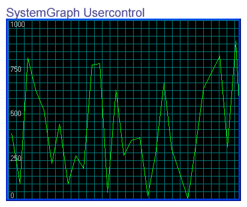



## SystemGraph

### Description

This usercontrol could be used to show your users the outgoing/incoming bandwidth or performance of your program live. This is done by constantly feeding the graph with new data, etc.
 
### More Info
 

             |
---                |---
**Submitted On**   |2003-10-06 21:35:34
**By**             |[TheDailyDeveloper](https://github.com/Planet-Source-Code/PSCIndex/blob/master/ByAuthor/thedailydeveloper.md)
**Level**          |Beginner
**User Rating**    |4.8 (19 globes from 4 users)
**Compatibility**  |VB 6\.0
**Category**       |[Custom Controls/ Forms/  Menus](https://github.com/Planet-Source-Code/PSCIndex/blob/master/ByCategory/custom-controls-forms-menus__1-4.md)
**World**          |[Visual Basic](https://github.com/Planet-Source-Code/PSCIndex/blob/master/ByWorld/visual-basic.md)
**Archive File**   |[SystemGrap196222142006\.zip](https://github.com/Planet-Source-Code/thedailydeveloper-systemgraph__1-63914/archive/master.zip)

